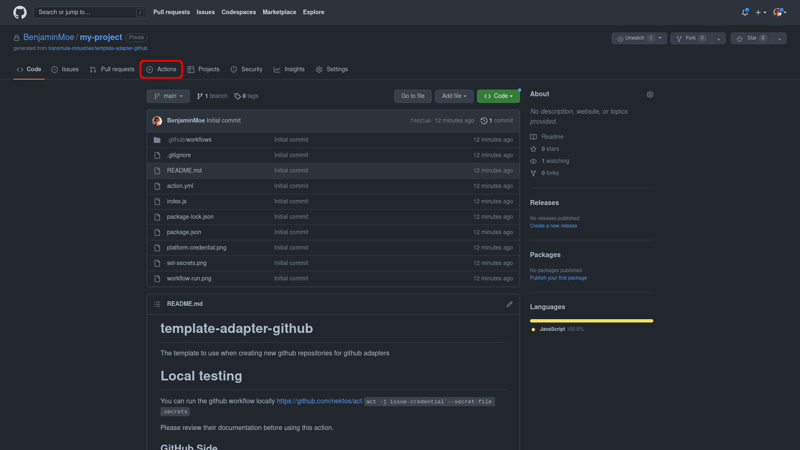
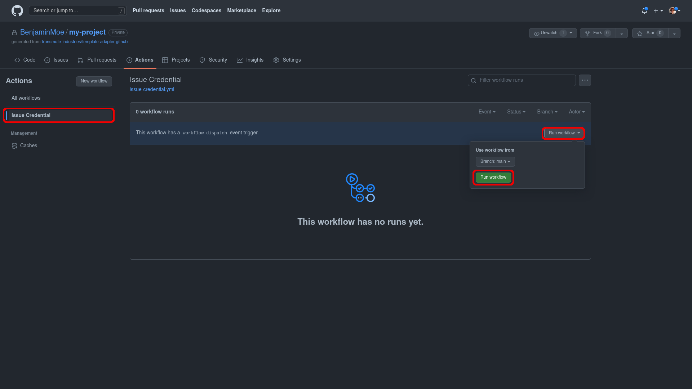
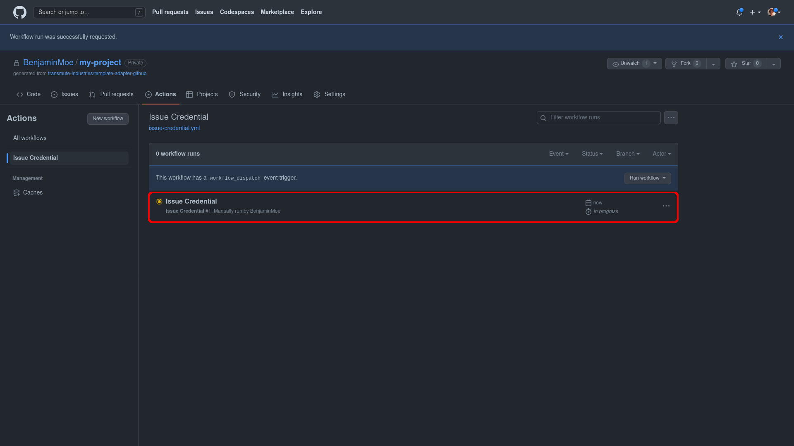
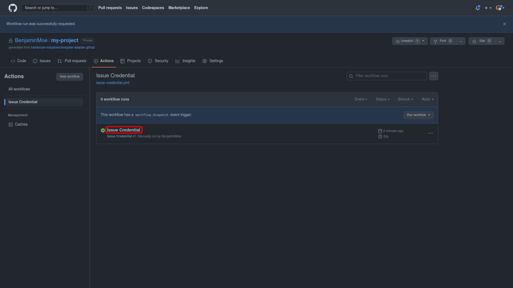
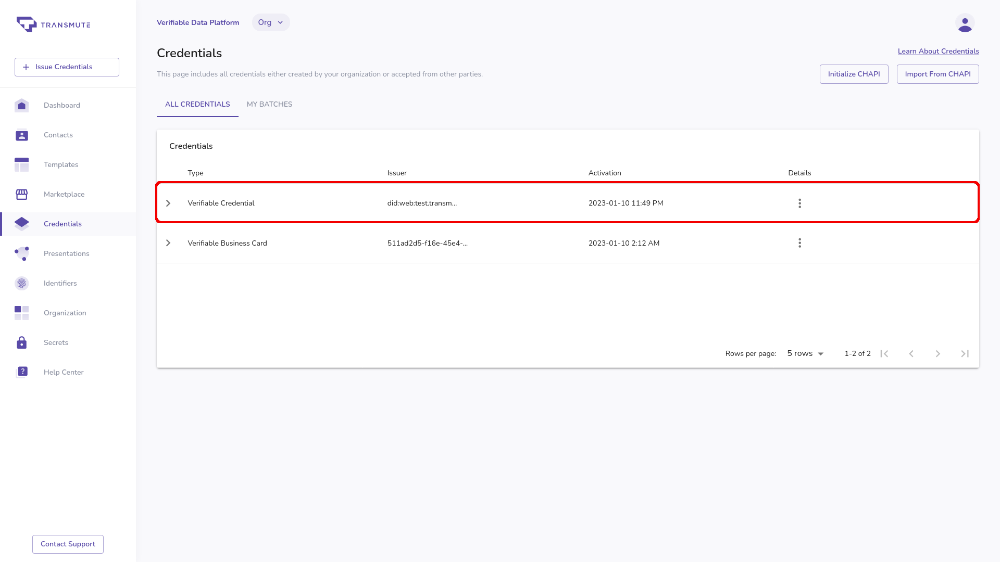

<p align="center">
  <a href="https://transmute.industries">
    
  </a>
</p>
<h1 align="center">
  Transmute Issue Credential Adapter
</h1>

This repository provides boilerplate for running and issue credential using the Verifiable Data Platform with
Github workflows. You can find this and other adapters at https://platform.transmute.industries/marketplace/adapters.

## 🚀 Quick start

### Step 01

To run the action to issue a credential, click on the Actions tab on the top of the repository.



### Step 02

On the actions page, click on the Issue Credential list item, then click the Run workflow dropdown. And click on the Run workflow button to trigger the action to issue the credential.



### Step 03

This will initialize a new action that will have a yellow spinning icon to indicate the workflow is running. Once the action is complete you should see the spinning yellow icon turn into a green check-mark.



### Step 04

Click on the Issue Credential text to see the details about the action that was run.



You can click on the issued-verifiable-credential artifact in order to download the credential that you issued. And example of what this should look like is displayed below.

```json
{
  "@context": "https://www.w3.org/2018/credentials/v1",
  "type": ["VerifiableCredential"],
  "issuer": "did:web:test.transmute.industries:organizations:org_pmybE9LVkDde9Jh7",
  "issuanceDate": "2023-01-10T14:49:39Z",
  "credentialSubject": {
    "id": "did:example:456"
  },
  "proof": {
    "type": "Ed25519Signature2018",
    "created": "2023-01-10T14:49:40Z",
    "verificationMethod": "did:web:test.transmute.industries:organizations:org_pmybE9LVkDde9Jh7#z6MkfJwuJniojSD6XmeQ3V9xkkaw6EZp53BnnMMUrQNxAGRM",
    "proofPurpose": "assertionMethod",
    "jws": "eyJhbGciOiJFZERTQSIsImI2NCI6ZmFsc2UsImNyaXQiOlsiYjY0Il19..IOyALSto5FQwa8HUxM2e8dYrT8rQG__v0rT4hxCnPTaXMRSFL8DGWbo0q3kcemP20US9e4V80zlXqsttl9ezBg"
  }
}
```

### Step 05

If you want to verify that your credential was issued, you can navigate to your list of credentials in the application to see the credential populated there.



Congratulations on issuing your first credential with a workflow. See what other functionality we can help you unlock with Github workflows.

## Learn more

- [Documentation](https://www.gatsbyjs.com/docs/?utm_source=starter&utm_medium=readme&utm_campaign=minimal-starter-ts)

- [Tutorials](https://www.gatsbyjs.com/tutorial/?utm_source=starter&utm_medium=readme&utm_campaign=minimal-starter-ts)

- [Guides](https://www.gatsbyjs.com/tutorial/?utm_source=starter&utm_medium=readme&utm_campaign=minimal-starter-ts)

- [API Reference](https://www.gatsbyjs.com/docs/api-reference/?utm_source=starter&utm_medium=readme&utm_campaign=minimal-starter-ts)

- [Plugin Library](https://www.gatsbyjs.com/plugins?utm_source=starter&utm_medium=readme&utm_campaign=minimal-starter-ts)

- [Cheat Sheet](https://www.gatsbyjs.com/docs/cheat-sheet/?utm_source=starter&utm_medium=readme&utm_campaign=minimal-starter-ts)

## Help and Support

Deploy this starter with one click on [Gatsby Cloud](https://www.gatsbyjs.com/cloud/):

[](https://www.gatsbyjs.com/dashboard/deploynow?url=https://github.com/gatsbyjs/gatsby-starter-minimal-ts)
