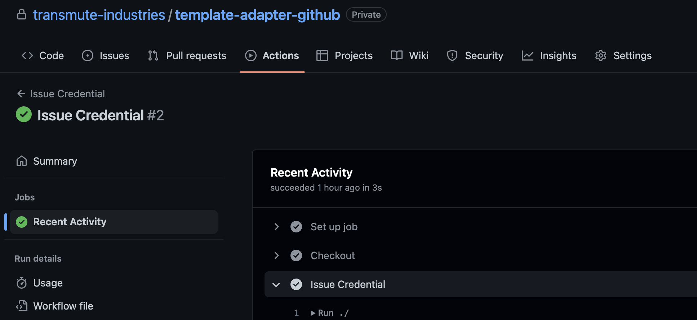
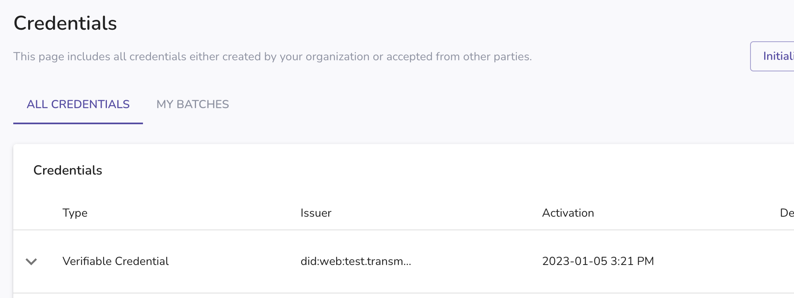
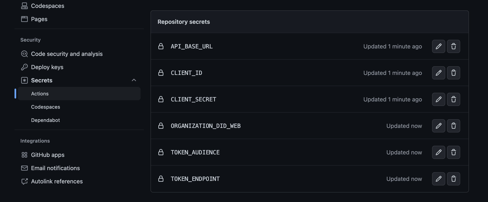

# template-adapter-github

The template to use when creating new github repositories for github adapters

# Local testing

You can run the github workflow locally https://github.com/nektos/act
`act -j issue-credential --secret-file .secrets`

Please review their documentation before using this action.

## GitHub Side



## Transmute Side



### Setup

```shell
./env-to-repo-secrets.sh .env
```



### Examples

See [issue-credential.yml](./.github/workflows/issue-credential.yml)
